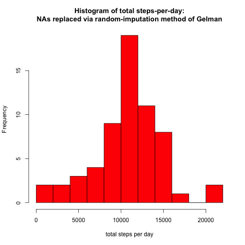
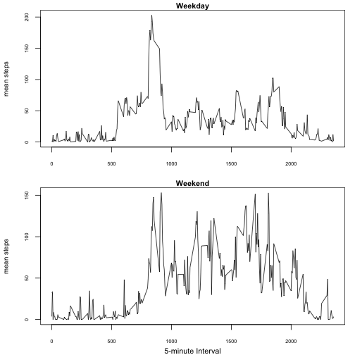

---
#title: "Reproducible Research: Peer Assessment 1"  
##author: "William Michels"  
##date: "February 15, 2015"  
output:   
  html_document:  
    keep_md: true  
----  
  
## Loading and preprocessing the data 

1.    Load the data (i.e. `read.csv()`)

2.    Process/transform the data (if necessary) into a format suitable for your analysis: 

```r
#go to home directory
setwd("~/")

#create new directory for download:
if (!file.exists("Activity_monitoring_data")) {
      dir.create("Activity_monitoring_data")
}

#move to the new directory:
setwd("~/Activity_monitoring_data")

# Download the data and unzip it
source <- "https://d396qusza40orc.cloudfront.net/repdata%2Fdata%2Factivity.zip"

library(bitops)
library(RCurl)

# create a temporarily file
file_zipped <- tempfile()

# download file
download.file(url=source, destfile=file_zipped, method="curl", mode="wb")

# unzip file to the current working directory
unzip(zipfile=file_zipped)

# clean the temporarily file
rm(file_zipped)

activity <- read.csv(file="./activity.csv", header=T, sep=',')
```


## What is mean total number of steps taken per day?

For this part of the assignment, you can ignore the missing values in the dataset.

1.    Calculate the total number of steps taken per day

```r
x1a <- aggregate(activity$steps, by=list(activity$date), sum)
colnames(x1a) <- c("date", "total_steps")
x1a
```

```
##          date total_steps
## 1  2012-10-01          NA
## 2  2012-10-02         126
## 3  2012-10-03       11352
## 4  2012-10-04       12116
## 5  2012-10-05       13294
## 6  2012-10-06       15420
## 7  2012-10-07       11015
## 8  2012-10-08          NA
## 9  2012-10-09       12811
## 10 2012-10-10        9900
## 11 2012-10-11       10304
## 12 2012-10-12       17382
## 13 2012-10-13       12426
## 14 2012-10-14       15098
## 15 2012-10-15       10139
## 16 2012-10-16       15084
## 17 2012-10-17       13452
## 18 2012-10-18       10056
## 19 2012-10-19       11829
## 20 2012-10-20       10395
## 21 2012-10-21        8821
## 22 2012-10-22       13460
## 23 2012-10-23        8918
## 24 2012-10-24        8355
## 25 2012-10-25        2492
## 26 2012-10-26        6778
## 27 2012-10-27       10119
## 28 2012-10-28       11458
## 29 2012-10-29        5018
## 30 2012-10-30        9819
## 31 2012-10-31       15414
## 32 2012-11-01          NA
## 33 2012-11-02       10600
## 34 2012-11-03       10571
## 35 2012-11-04          NA
## 36 2012-11-05       10439
## 37 2012-11-06        8334
## 38 2012-11-07       12883
## 39 2012-11-08        3219
## 40 2012-11-09          NA
## 41 2012-11-10          NA
## 42 2012-11-11       12608
## 43 2012-11-12       10765
## 44 2012-11-13        7336
## 45 2012-11-14          NA
## 46 2012-11-15          41
## 47 2012-11-16        5441
## 48 2012-11-17       14339
## 49 2012-11-18       15110
## 50 2012-11-19        8841
## 51 2012-11-20        4472
## 52 2012-11-21       12787
## 53 2012-11-22       20427
## 54 2012-11-23       21194
## 55 2012-11-24       14478
## 56 2012-11-25       11834
## 57 2012-11-26       11162
## 58 2012-11-27       13646
## 59 2012-11-28       10183
## 60 2012-11-29        7047
## 61 2012-11-30          NA
```

2.    Make a histogram of the total number of steps taken each day *(use breaks = "Freedman-Diaconis" to get nicer layout)*

```r
hist(x1a$total_steps, freq=T, breaks = "Freedman-Diaconis", col = 2, xlab = "total steps per day", main = "Histogram of total steps-per-day\n(NAs untouched)")
```

 

3.    Calculate and report the mean and median of the total number of steps taken per day *(per Coursera CTA David Hood re median(): "Calculate the totals (which are not zero so the median will not be zero), then take the median of the totals." Mean() is calculated the same way herein. https://class.coursera.org/repdata-011/forum/thread?thread_id=72#post-265*


```r
mean(x1a$total_steps, na.rm =T)
```

```
## [1] 10766.19
```

```r
median(x1a$total_steps, na.rm =T)
```

```
## [1] 10765
```


## What is the average daily activity pattern?

1.    Make a time series plot (i.e. type = "l") of the 5-minute interval (x-axis) and the average number of steps taken, averaged across all days (y-axis)
    

```r
x3a <- aggregate(activity$steps, by=list(activity$interval), mean, na.rm =T)

colnames(x3a) <- c("interval", "mean_steps")

plot(x3a$interval, x3a$mean_steps, type = "l", xlab = "Interval (5-min duration)", ylab = "mean # of steps", main = "Mean # steps by 5-min time-of-day Interval)")
```

 

2.    Which 5-minute interval, on average across all the days in the dataset, contains the maximum number of steps?


```r
subset(x3a, x3a$mean_steps == max(x3a$mean_steps))
```

```
##     interval mean_steps
## 104      835   206.1698
```


## Imputing missing values

Note that there are a number of days/intervals where there are missing values (coded as NA). The presence of missing days may introduce bias into some calculations or summaries of the data.

1.    Calculate and report the total number of missing values in the dataset (i.e. the total number of rows with NAs)

```r
summary(is.na(activity$steps))
```

```
##    Mode   FALSE    TRUE    NA's 
## logical   15264    2304       0
```

2.    Devise a strategy for filling in all of the missing values in the dataset. Create a new dataset that is equal to the original dataset but with the missing data filled in.
    
    *Use random imputation method and code from Professor Andrew Gelman at Columbia University pg. 533 (http://www.stat.columbia.edu/~gelman/arm/missing.pdf). Create random imputation function:* 
    

```r
random.imp <- function (a){
missing <- is.na(a)
n.missing <- sum(missing)
a.obs <- a[!missing]
imputed <- a
imputed[missing] <- sample(a.obs, n.missing, replace=TRUE) 
return (imputed)
}
```
*Duplicate original "activity" dataset and specifically impute missing "step" values:*

```r
activity2 <- activity
activity2$steps <- random.imp(activity2$steps)
table(is.na(activity2))
```

```
## 
## FALSE 
## 52704
```

3.   Make a histogram of the total number of steps taken each day and Calculate and report the mean and median total number of steps taken per day. 


```r
x4a <- aggregate(activity2$steps, by=list(activity2$date), sum)

colnames(x4a) <- c("date", "total_steps")

hist(x4a$total_steps, freq=T, breaks = "Freedman-Diaconis", col = 2, xlab = "total steps per day", main = "Histogram of total steps-per-day:\nNAs replaced via random-imputation method of Gelman")
```

 

```r
mean(x4a$total_steps, na.rm =T)
```

```
## [1] 10610.7
```

```r
median(x4a$total_steps, na.rm =T)
```

```
## [1] 10571
```

4a.   Q. Do these values differ from the estimates from the first part of the assignment? *Yes, the random imputation method of Gelman results in imputed data having a mean/median approximately 100 steps lower than non-imputed data.*

4b.   Q. What is the impact of imputing missing data on the estimates of the total daily number of steps? *Graphically there is modest change, with the major peak (centering at approx. 10,000 to 12,000 steps per day) getting higher, consistent with an overall increase in the number of values after imputing NAs.*

## Are there differences in activity patterns between weekdays and weekends?


```r
oldPar <- par(no.readonly=TRUE)
xpd = TRUE
par(mar = c(3,4,1,1))
par(oma = c(0,0,0,0))
par(mfrow=c(2,1))

activity3 <- activity2
activity3$date <- as.POSIXct(activity3$date, tz = "GMT")
weekdays_1 <- activity3[!(weekdays(activity3$date) %in% c('Saturday','Sunday')), ]
weekends_1 <- activity3[(weekdays(activity3$date) %in% c('Saturday','Sunday')), ]

weekdays_agg <- aggregate(weekdays_1$steps, by=list(weekdays_1$interval), mean, na.rm =T)
colnames(weekdays_agg) <- c("interval", "mean_steps")

weekends_agg <- aggregate(weekends_1$steps, by=list(weekends_1$interval), mean, na.rm =T)
colnames(weekends_agg) <- c("interval", "mean_steps")

plot(weekdays_agg$interval, weekdays_agg$mean_steps, type = "l", cex.main = 0.9, cex.axis = 0.6, cex.lab = 0.8, xlab= "", ylab = "mean steps", main = "Weekday")

plot(weekends_agg$interval, weekends_agg$mean_steps, type = "l", cex.main = 0.9, cex.axis = 0.6, cex.lab = 0.8, ylab = "mean steps", main = "Weekend")
mtext("5-minute Interval", line= 2, side = 1, cex = 0.9)
```

 

```r
par(oldPar)
```

*Yes, the weekday graph indicates a peak between interval #800-900, with much less activity during the rest of the day, while the weekend graph indicates steps are taken much more evenly throughout the day, and even at night.*
######
